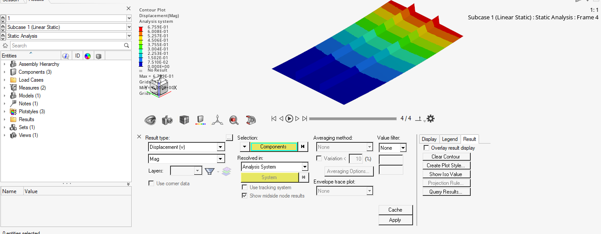

# Aircraft Stiffened Panel Buckling Analysis

Finite Element and Analytical Buckling Assessment of a Simplified Aircraft Fuselage Panel under Axial Compression.

---

## Overview

This project investigates the buckling behavior of a simplified aircraft stiffened panel subjected to axial compressive loading. The study combines:

- Finite Element Analysis (FEA) using Altair HyperWorks / OptiStruct
- Simplified analytical buckling calculations
- Comparison between analytical and numerical approaches

The objective is to evaluate how buckling governs the structural response of thin-walled aerospace structures and to demonstrate the importance of stability analysis in aircraft design.

---

## Geometry

### Skin

| Parameter | Value |
|------------|---------|
| Length | 500 mm |
| Width | 300 mm |
| Thickness | 1.5 mm |

### Stringers

| Parameter | Value |
|------------|---------|
| Quantity | 2 |
| Length | 500 mm |
| Height | 30 mm |
| Flange Width | 30 mm |
| Thickness | 1.5 mm |

---

## Material

Aluminum Alloy 2024-T3

| Property | Value |
|------------|---------|
| Young's Modulus | 73 GPa |
| Poisson Ratio | 0.33 |
| Density | 2780 kg/m³ |

---

## Finite Element Model

### Software

- HyperMesh
- OptiStruct
- HyperView

### Element Type

- Shell Elements (CQUAD4)

### Analyses Performed

1. Linear Static Analysis
2. Linear Eigenvalue Buckling Analysis

### Boundary Conditions

- One panel edge constrained
- Axial compressive load applied on the opposite edge
- Shell representation for skin and stiffeners

---

## Linear Static Results

### Total Displacement

<p align="center">

</p>

Maximum displacement:

```text
0.676 mm
```

---

### Von Mises Stress

<p align="center">

</p>

Maximum stress:

```text
30.34 MPa
```

The stress level remains significantly below the yield strength of Aluminum 2024-T3 (~324 MPa), indicating that material failure is not expected under the applied reference load.

---

## Linear Buckling Results

### Buckling Mode 1

<p align="center">

</p>

Buckling factor:

```text
0.288
```

---

### Buckling Mode 3

<p align="center">

</p>

Buckling factor:

```text
0.522
```

---

### Buckling Mode 5

<p align="center">

</p>

Buckling factor:

```text
0.648
```

---

### Buckling Mode 7

<p align="center">

</p>

Buckling factor:

```text
0.822
```

---

## Critical Buckling Load

Reference compressive load:

```text
10 kN
```

Critical load for the first buckling mode:

\[
P_{cr}= \lambda P_{ref}
\]

\[
P_{cr}=0.288 \times 10
\]

\[
P_{cr}=2.88 \, kN
\]

---

## Simplified Analytical Calculation

The analytical estimate considers local skin buckling between adjacent stringers using the classical plate buckling equation:

\[
\sigma_{cr}=
\frac{k\pi^2E}
{12(1-\nu^2)}
\left(\frac{t}{b}\right)^2
\]

Where:

| Parameter | Value |
|------------|---------|
| E | 73 GPa |
| ν | 0.33 |
| t | 1.5 mm |
| b | 100 mm |
| k | 4 |

### Critical Buckling Stress

\[
\sigma_{cr}=60.4 \, MPa
\]

### Critical Buckling Load

\[
P_{cr}=9.06 \, kN
\]

---

## Analytical vs FEM Comparison

| Method | Critical Load |
|----------|----------|
| Analytical | 9.06 kN |
| FEM Buckling | 2.88 kN |

Difference:

\[
214.9\%
\]

---

## Discussion

The analytical solution predicts a significantly higher critical load than the finite element model.

This difference is expected because the analytical approach assumes:

- Perfect geometry
- Ideal boundary conditions
- Pure local plate buckling
- No interaction between skin and stiffeners
- No global deformation effects

In contrast, the finite element model captures:

- Realistic support conditions
- Skin-stiffener interaction
- Global structural deformation
- Load redistribution effects
- Multiple buckling modes

As a result, the FEM solution provides a more conservative and realistic prediction of the panel stability.

---

## Conclusion

This study demonstrates that buckling is the governing failure mechanism for the analyzed aircraft panel.

Although the maximum von Mises stress remained low (30.34 MPa) and far below the material yield strength, the structure became unstable at a much lower load due to buckling.

The simplified analytical calculation predicted a critical load of approximately 9.06 kN, while the finite element buckling analysis predicted a critical load of only 2.88 kN.

The discrepancy highlights the limitations of classical analytical methods when applied to real aerospace structures. While analytical equations are valuable for preliminary sizing and engineering estimates, finite element analysis is essential for capturing boundary condition effects, skin-stiffener interaction, and global instability modes.

This project illustrates a typical aerospace structural design scenario where stability, rather than material strength, controls the allowable load.

---

## Repository Structure

```text
aircraft-stiffened-panel-buckling/
│
├── fem/
│   ├── model.hm
│   ├── model.fem
│
├── python/
│   └── analytical_buckling.py
│
├── results/
│   ├── displacement.png
│   ├── von_mises_stress.png
│   ├── buckling_mode1.png
│   ├── buckling_mode3.png
│   ├── buckling_mode5.png
│   └── buckling_mode7.png
│
└── README.md
```

## Keywords

Aircraft Structures, Aerospace Engineering, Buckling Analysis, Stiffened Panel, Finite Element Analysis, OptiStruct, Structural Stability, Fuselage Structures, HyperWorks.
